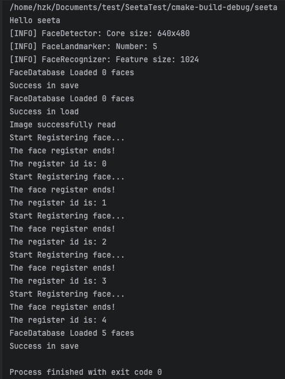
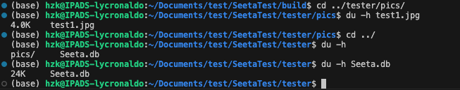

# Test of OpenCV and Seetaface2 functionality on Linux


## FaceDatabase Storage of Seetaface2

I take a jpg file of a woman's face from the Internet with the size of <u>4.0k</u>. Then the same face data is stored into the face database iteratively for **5 times** and save to the `Seeta.db` file I created in advance. The result turns out that the size of the database is <u>24K</u>.




*Size result:*




## Appendix

The link to the libs is: 

```tex
链接: https://pan.baidu.com/s/1Xvutm_D00780TsrIJyADNQ?pwd=ubtu 提取码: ubtu 
--来自百度网盘超级会员v5的分享
```


The link to the models: 
``` tex
链接: https://pan.baidu.com/s/1oL7SMy5X7KNt7E93Iz_xlg?pwd=ixvs 提取码: ixvs 
--来自百度网盘超级会员v5的分享
```